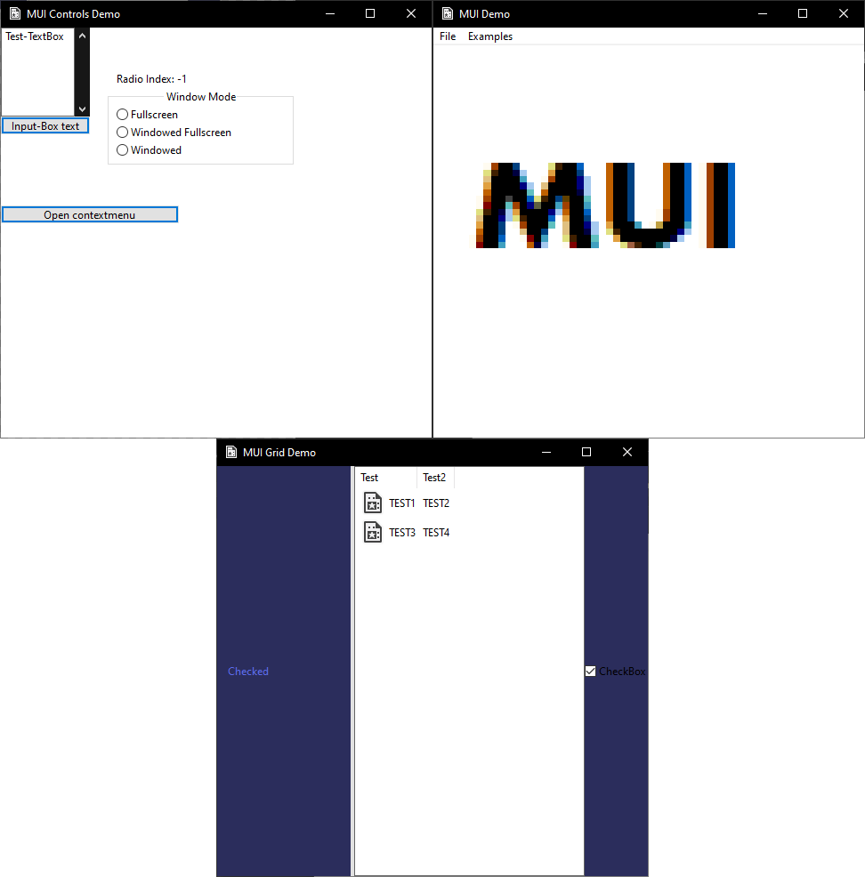

# **MUI** (*Murky User Interface*)
**MUI** is a custom made GUI framework i made in c++ which is built on top of the win32 windows api

(*the code is probably shit but at least it works :), if you have any code improvments i'll be happy*)
## Features
* Support modern style
  * If you want to disable it change `#define NEW_STYLE 1` to `#define NEW_STYLE 0` 
* Window
  * You can change its minimal size and maximum size
  * You can change its title and icon
  * You can select whether or not exit when all windows are closed (inside `MUI.h` `#define EXIT_ON_CLOSE 1`)
* Kind of components based system with callbacks `(std::function)`
* Components list:
   * Button
   * CheckBox
   * Grid (you have to explicitly set the grid by using `window->SetGrid(grid)` as in the demo project)
   * Image
   * ListView
   * ListItem
   * RadioGroup
   * RadioButton
   * TextBlock
   * TextBox
   * MenuBar
   * Menu
   * ContextMenu
* Custom coloring of each component type(works best with `#define NEW_STYLE 0` )
## Demo project
*You can find a demo project inside the `Demo` folder, this project is where i test new features and additions*

## Building instructions
1. Download Visual Studio 2022 with Windows 11 SDK (10.0.22000.0)
2. Open the `MUI.sln` solution file
3. Build and compile!
